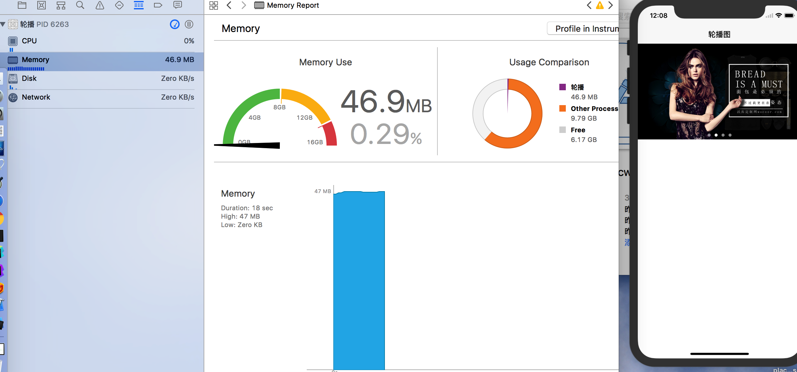
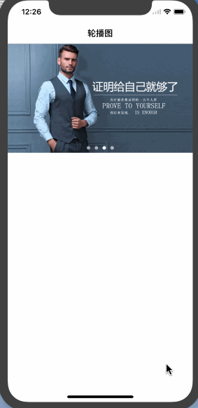

# ZYCycleView-
ZYCycleView(图片轮播器)

* 几行代码搞定图片轮播器
* CollectionView复用cell的机制,不管当前的section有道少了item,当cell的宽和屏幕的宽一致是,当前屏幕最多显示两个cell(图片切换时是两个cell),切换完成时有且仅有一个cell,即使放大1000倍,内存中最多加载两个cell,所以不会造成内存暴涨现象

``` Objective-C版
#import "ViewController.h"
#import "ZYCycleView.h"
#import "DemoViewController.h"

@interface ViewController ()<ZYCycleViewDelegate>
@property (nonatomic, copy) NSArray *imageURLStringArr;
@end

@implementation ViewController

- (void)viewDidLoad {
    [super viewDidLoad];
    self.title = @"轮播图";
    self.view.backgroundColor = [UIColor whiteColor];
    [self setUpUI];
}

#pragma mark 点击的是第几个图片
- (void)cycleView:(ZYCycleView *)cycleView didSelectItemAtIndex:(NSInteger)index{
    DemoViewController *demo = [[DemoViewController alloc] init];
    demo.title = [NSString stringWithFormat:@"第%d个图片的跳转",(int)index + 1];
    demo.view.backgroundColor = [UIColor whiteColor];
    [self.navigationController pushViewController:demo animated:YES];
}

#pragma mark 设置UI
- (void)setUpUI {
    CGFloat pointY = 44 + [UIApplication sharedApplication].statusBarFrame.size.height;
    ZYCycleView *cycleView = [[ZYCycleView alloc] initWithFrame:CGRectMake(0, pointY, [UIScreen mainScreen].bounds.size.width, 220)];
    cycleView.imageURLStringArr = self.imageURLStringArr;
    cycleView.mode = HMCycleViewContentModeScaleAspectFill;
    cycleView.delegate = self;
    [self.view addSubview:cycleView];
}

#pragma mark 懒加载
- (NSArray *)imageURLStringArr{
    if (_imageURLStringArr == nil) {
        _imageURLStringArr = @[
            @"http://www.wocoor.com/templates/images/banner01.jpg",
            @"http://www.wocoor.com/templates/images/banner02.jpg",
            @"http://www.wocoor.com/templates/images/banner03.jpg",
            @"http://www.wocoor.com/templates/images/banner04.jpg"
        ];
    }
    return _imageURLStringArr;
}

@end
```


## 效果图

<p align="center" >

</p>

<p align="center" >

</p>
